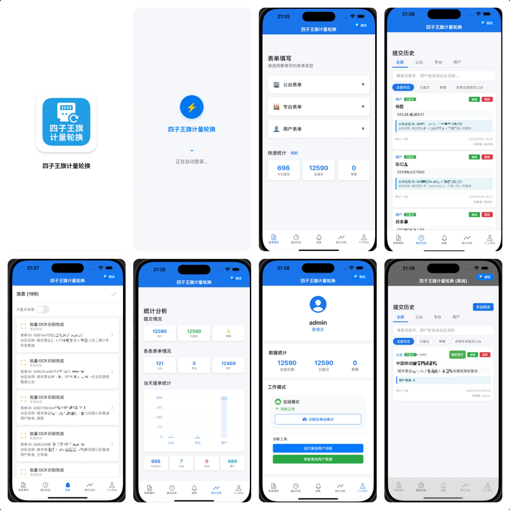

# Meterinfo App - 落地页

> Meterinfo App 产品介绍与引导页。

**在线地址：** https://meterinfoapp.junxinzhang.com

---

## 简介

本仓库包含 Meterinfo App 的落地页静态站点资源，适用于产品展示与转化引导。

## 主要内容

- 产品核心卖点展示
- 清晰的转化路径与行动按钮
- 响应式布局，移动端友好

## 技术栈

- HTML5 / CSS3 / JavaScript

## 本地预览

直接打开 `index.html` 即可预览。

## 部署

项目使用 GitHub Pages + Actions 自动部署。推送到 `main` 分支后会自动发布。

## 自定义域名

域名通过 `CNAME` 配置为：`meterinfoapp.junxinzhang.com`。

---

# Meterinfo App - Landing Page (English)

> Product marketing and conversion landing page for Meterinfo App.

**Live Site:** https://meterinfoapp.junxinzhang.com

## Overview

This repository contains the static landing page assets for Meterinfo App.

## Highlights

- Clear product value proposition
- Strong CTA flow
- Responsive layout for mobile and desktop

## Tech Stack

- HTML5 / CSS3 / JavaScript

## Local Preview

Open `index.html` directly in a browser.

## Deployment

Deployed via GitHub Pages with GitHub Actions. Push to `main` to publish.

## Custom Domain

Configured in `CNAME`: `meterinfoapp.junxinzhang.com`.
